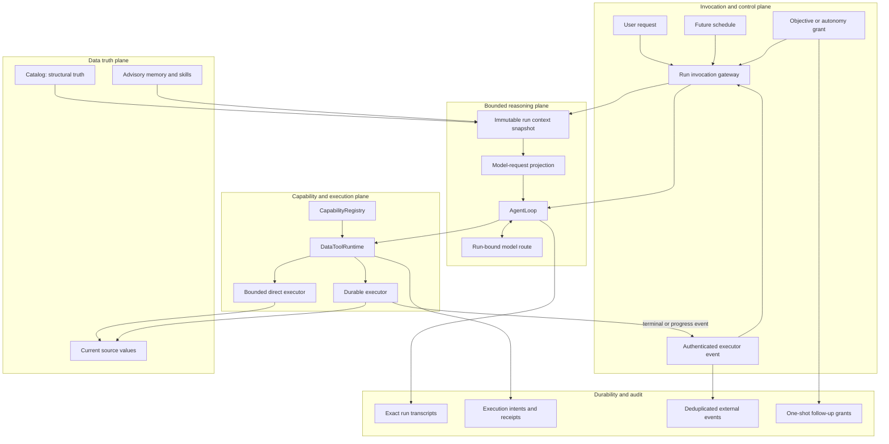

# Daita North Star Architecture

- Date: 2026-07-24
- Status: North Star architecture decision; staged implementation, not a claim
  about current product behavior
- Audience: Product, architecture, and engineering contributors
- Scope: The durable foundation for an agentic data-operations controller
- Current baseline: The embedded, transcript-driven, read-only data agent in
  `src/daita/`

## 1. Executive decision

Daita's North Star is:

> Daita is an event-driven, catalog-grounded data-operations controller. It
> performs bounded reasoning runs, acts through governed capabilities,
> delegates long work to durable executors, and starts new bounded runs when
> relevant state changes.

The existing direct model/tool loop remains the reasoning kernel:

```text
request -> model -> zero or more tool calls -> ordered tool results
        -> model -> answer
```

The loop must not become a scheduler, workflow engine, durable worker, policy
engine, or indefinitely running model session. Long-running behavior emerges
from repeated bounded runs over durable, authoritative state:

```text
trusted trigger
-> inspect current truth
-> reason for a bounded period
-> execute bounded reads or submit durable work
-> persist exact receipts
-> terminate
-> wake again when relevant state changes
```

This architecture makes Daita an agentic operator for the whole data operating
environment, not merely an interface to external DAGs. Daita may inspect and
operate databases, warehouses, catalogs, files, transformation systems,
orchestrators, quality systems, and future Daita-managed execution services.
A DAG is one possible execution mechanism behind a capability, not the center
of the product architecture.

## 2. Status relative to the current MVP

The current product is a persistent, embedded, read-only data agent. It
supports bounded interactive runs against SQLite, PostgreSQL, CSV, and JSON.
It does not currently contain:

- durable external data-operation records;
- an invocation source other than a user call;
- event ingestion or deduplication;
- one-shot or recurring autonomous follow-up;
- a scheduler or durable worker;
- an external executor adapter;
- resumable model runs; or
- distributed multi-host execution.

The current exclusions in `AGENTS.md` remain authoritative until a later stage
in this document is explicitly accepted for implementation. In particular,
this document does not authorize speculative `Operation`, `Task`, `Workflow`,
event-bus, scheduler, checkpoint, or resume frameworks.

Before Stage B or Stage C begins, the repository scope must be updated
explicitly to permit only the named vertical slice. The update must preserve
the direct loop and continue prohibiting a generic workflow runtime.

## 3. System context



The diagram is a target decomposition. The first implementation remains local
and embedded. Distributed hosting, recurring schedules, and a Daita-owned
durable executor are post-MVP concerns.

## 4. Architectural invariants

### 4.1 One bounded reasoning loop

`daita.loop.driver.AgentLoop` remains the only model/tool progression loop. It
owns:

- starting one run transcript;
- invoking the selected model;
- appending normalized assistant and tool messages;
- calling the injected tool runtime;
- enforcing outer step, wall-time, token, and estimated-cost limits;
- finishing one terminal result; and
- returning one `LoopExit`.

It does not own:

- source or executor clients;
- catalog operations;
- provider-native recovery;
- authorization policy;
- schedules or external events;
- external execution lifecycle state;
- durable approvals;
- operation retries;
- job progress;
- worker coordination; or
- cross-run objectives.

### 4.2 Exact transcript as current-run state

The exact canonical transcript remains the evolving state of one reasoning
run. A static run context snapshot may be prepared before the first model call,
but it is not a second evolving runtime, checkpoint, or session.

No model-authored summary replaces the current-run transcript. Prior completed
runs may be projected deterministically and boundedly for conversation
continuity, but durable transcripts remain exact.

### 4.3 Every tool call receives one result

Every model-requested tool call receives exactly one result in original call
order. This remains true when:

- independent reads execute concurrently;
- one call fails;
- the run is cancelled;
- a side effect has completed before cancellation is observed; or
- a batch is interrupted after some calls have completed.

If a call never began, its terminal result may be a structured cancellation or
deadline error. If a side effect's outcome is known, the actual outcome must be
persisted before interruption propagates.

### 4.4 Long work outlives the model run

A long-running data operation has an identity and lifecycle independent of
the run that submitted it. The submitting tool call completes when it returns a
validated durable receipt; it does not hold the model loop open until the work
finishes.

### 4.5 Recovery at run boundaries

Daita does not resume a model coroutine from an arbitrary await after process
loss. A later bounded run re-reads current catalog, source, and executor state
and decides the next action from that evidence.

This avoids replaying non-deterministic model output, changing external data,
approval decisions, provider responses, or source I/O.

### 4.6 Authority, intent, and evidence remain separate

No record acquires authority merely because it is persisted or placed in a
graph. User authority, structural truth, source values, execution state,
historical events, model explanations, and advisory context retain distinct
trust classes.

### 4.7 At-least-once delivery, idempotent effects

Network delivery is not assumed to be exactly once. External events may be
duplicated, delayed, or delivered out of order. Submission responses may be
lost after an executor accepted work.

The architecture uses:

- stable identities;
- event deduplication;
- conditional state transitions;
- idempotent submissions where supported;
- explicit outcome uncertainty; and
- authoritative reconciliation.

## 5. Truth and trust model

| Record | Meaning | Authority |
| --- | --- | --- |
| Current catalog snapshot | Registered source/resource identity, schema, facets, relationships, freshness | Authoritative structural truth |
| Current validated tool result | Values returned by one validated execution | Authoritative only for the values and observation time it contains |
| Durable executor status | Current state of submitted work | Authoritative execution truth |
| Execution binding in Daita | Correlation, audit link, and last observed state | Not authoritative over fresher executor state |
| User objective or grant | User intent, permitted scope, budget, and expiration | Authoritative only within its exact bounds |
| Authenticated trigger envelope | Why the system woke and which subject changed | Authoritative for source identity and authenticated event metadata |
| External event payload | Details supplied by the emitter | Untrusted data until inspected against the authoritative executor |
| Exact run transcript | Messages, calls, and results that occurred in one run | Authoritative audit of the run, not current source truth |
| Memory and user profile | Durable preferences and advisory semantics | Advisory; never structural truth or authorization |
| Skill content | User-authorized procedure | Procedural guidance; never execution authority or data truth |
| Model explanation or plan | Proposed interpretation and next action | Non-authoritative until validated through existing owners |

An optional future evidence or knowledge graph may carry derived facts and
provenance. It must remain distinct from the catalog, execution state, and
authorization. LLM-extracted edges are derived claims, not automatic ground
truth.

## 6. Invocation and control plane

### 6.1 Purpose

The invocation boundary answers:

- who or what requested a run;
- why the run is allowed to start;
- which conversation it belongs to;
- which grant, if any, constrains it;
- what trusted instruction applies; and
- which attached payloads remain untrusted data.

### 6.2 Conceptual invocation record

The exact production record should be introduced only with its first vertical
slice. Conceptually it needs:

```text
RunInvocation
  id
  agent_id
  conversation_id
  origin
  principal_id
  trigger_id
  grant_id
  created_at
```

Initial origins are:

```text
user
external_event
```

Future origins may include:

```text
schedule
operator_recovery
```

### 6.3 Event-originated runs

For an executor event:

1. The hosting boundary authenticates the event source.
2. The event ID is deduplicated.
3. The event is correlated to a known execution binding.
4. A current, unexpired follow-up grant is verified.
5. A code-owned follow-up instruction is selected.
6. Event content is attached as untrusted data.
7. A new bounded run is started.
8. The run inspects the executor directly before trusting status claims.

Authentication does not make arbitrary event text an instruction. An event
cannot create or expand its own grant.

### 6.4 MVP control-plane boundary

The first control-plane slice supports only:

- normal user runs;
- one authenticated terminal event type for one executor;
- one execution-bound, read-only follow-up grant;
- one successful follow-up maximum;
- a fixed expiration;
- a fixed per-run budget; and
- a code-owned follow-up instruction.

It does not support generic cron expressions, recurring objectives, arbitrary
event subscriptions, model-authored triggers, or production remediation.

## 7. Bounded reasoning plane

### 7.1 Required response state machine

Canonical model finish reasons must control progression:

```text
START
  -> persist invocation/user message
  -> build model request
  -> invoke model

STOP
  -> require text and no tool calls
  -> atomically persist final assistant message and completed LoopExit

TOOL_CALLS
  -> require one or more calls
  -> persist assistant tool-call message
  -> execute every call through DataToolRuntime
  -> persist one ordered result per call
  -> continue

LENGTH
  -> do not report ordinary completion
  -> return an explicit bounded-limit or incomplete outcome

CONTENT_FILTER
  -> return an explicit filtered outcome

ERROR
  -> return a normalized provider failure
```

The outer-limit wrap-up may make at most one tool-free model call. Only a
`STOP` response with final text can complete that wrap-up successfully.

### 7.2 Immutable run context snapshot

Before the first model request, the context owner prepares a static snapshot
containing:

- model profile;
- projected tool definitions;
- bounded completed conversation history;
- advisory memory and user profile;
- bounded skill index;
- relevant catalog context;
- sensitivity;
- invocation origin; and
- applicable grant reference and scope.

Each step is then built from:

```text
static run snapshot + exact current-run transcript
```

Tool execution still validates against current catalog facts immediately
before source or executor I/O. A stale planning snapshot may cause a structured
model-visible validation error; it never authorizes execution against stale
facts.

### 7.3 Context pressure

The context owner must:

- use a documented conservative token estimate or provider tokenizer when
  available;
- include tool and response schemas;
- reserve output capacity;
- incorporate actual prior prompt usage when available;
- preserve whole tool call/result exchanges;
- keep the exact current-run transcript durable;
- bound model-facing data evidence; and
- fail with an explicit context result rather than silently corrupting
  history.

Current data evidence must not be replaced by an LLM-authored summary. When
tool-result pressure is too high, the model should receive a structured request
to narrow rows, columns, filters, or aggregation.

### 7.4 Run-bound model routing

Provider retry and fallback remain in `daita.llm.routing`. When fallback
succeeds, the selected provider should remain stable for the rest of the run.
The next independent run may begin with the normal route order.

The generic loop does not gain provider-specific retry branches.

## 8. Capability and execution plane

### 8.1 Existing ownership remains

`CapabilityRegistry` owns:

- capability identity;
- executor identity;
- model-facing tool views;
- argument schema;
- output schema; and
- stable access and side-effect metadata.

`DataToolRuntime` remains the sole model-to-execution boundary. Its invariant
order remains:

1. project applicable tools;
2. reject an unavailable call;
3. resolve tool view and capability identity;
4. validate arguments;
5. validate against current catalog facts;
6. resolve the exact registered executor;
7. apply the fixed side-effect governance branch where required;
8. execute once;
9. validate the output contract; and
10. return one structured result.

No model-authored content, tool view, `Agent`, or `AgentLoop` may call an
executor directly.

### 8.2 Immediate execution

Immediate capabilities complete within the bounded run:

```text
query SQL
read a file slice
search or inspect the catalog
inspect a durable execution
read bounded execution results
```

Independent reads may execute concurrently. Side effects remain barriers.
Results are returned and persisted in original call order.

### 8.3 Durable submission

A long operation is submitted through a capability whose immediate result is a
bounded receipt:

```json
{
  "execution_id": "exec_123",
  "executor": "quality_service",
  "external_id": "scan_987",
  "kind": "quality_scan",
  "submission": "accepted",
  "observed_state": "submitted",
  "outcome_certainty": "known",
  "submitted_at": "2026-07-24T14:15:00Z",
  "status_capability": "inspect_quality_scan"
}
```

The receipt schema is capability-specific for the first vertical slice. A
shared abstraction should be extracted only after multiple real capabilities
demonstrate the same stable contract.

### 8.4 Submission certainty and executor status

Submission outcome and current execution status are separate.

Submission certainty:

```text
not_attempted
accepted
rejected
outcome_unknown
```

Observed executor status:

```text
queued
running
succeeded
failed
cancelled
unknown
```

If the connection fails after submission, Daita records
`outcome_unknown`. It does not blindly retry unless the submission is
idempotent. A later inspection reconciles by the stable execution or
idempotency identity.

### 8.5 Idempotency

Every side-effecting submission receives a stable execution key derived from
canonical facts such as:

```text
agent ID
run ID
canonical tool-call ID
capability ID
hash of frozen validated arguments
```

The exact formula must be deterministic and version-independent for the
unreleased implementation. Secret values are never embedded in the key or
durable arguments; secret references remain behind the security boundary.

The executor uses this key when it supports native idempotency. Otherwise, the
adapter must provide an explicit reconciliation method or report that the
outcome is uncertain.

### 8.6 Safe submission sequence

The fixed submission sequence is:

```text
validate arguments
-> capability-specific preflight
-> obtain exact approval when required
-> revalidate current state
-> freeze non-secret canonical arguments
-> persist execution intent and idempotency key
-> submit once
-> persist accepted, rejected, or uncertain receipt
-> persist the tool result
```

Persisting intent before external I/O allows recovery when the executor accepts
work but the response is lost.

### 8.7 Durable executor boundary

The first long-running operation should use an executor that already owns
durable work. Examples include a warehouse-native job system, a data-quality
service, dbt, Airflow, Prefect, Databricks Jobs, or a customer-provided
orchestrator.

This does not make Daita merely an agentic operator for DAGs. Daita owns
cross-system understanding, validation, authorization, action selection,
interpretation, and postcondition verification. The durable executor owns
keeping work alive, worker scheduling, progress, and current execution state.

A Daita-owned executor is optional post-MVP work and remains outside
`AgentLoop`.

## 9. Durability and audit

### 9.1 Exact run transcripts

Run transcripts continue to store only canonical messages from that run.
Prior history and static context are visible to model requests but are not
copied into the new transcript.

Completed prior runs may contribute to a later conversation projection.
Failed, interrupted, unfinished, or structurally invalid runs remain
inspectable but do not become conversational truth.

### 9.2 Atomic terminal completion

The final assistant message and `LoopExit` must be persisted atomically. A
process crash must not produce a completed assistant answer without its
terminal result or a terminal result without its final message.

### 9.3 Host-loss closure

When the exclusive agent-home writer is acquired after a prior process ended,
unfinished local runs from the prior owner may be closed as interrupted with a
specific host-loss reason. They are not resumed or projected into future
conversation history.

Closing an orphan does not invent missing external outcomes. Any persisted
execution intent with uncertain status is reconciled through its executor.

### 9.4 Execution binding

The first asynchronous vertical slice needs a durable correlation record:

```text
execution_id
agent_id
conversation_id
originating_run_id
originating_call_id
capability_id
executor_kind
external_id, when known
idempotency_key
frozen_argument_hash
submission_certainty
last_observed_status
observed_at
created_at
```

This record is:

- an index from a Daita call to external work;
- the durable submission receipt;
- the correlation target for an event; and
- the last observed status.

It is not a replacement for authoritative executor state.

### 9.5 External event record

A deduplicated normalized event needs:

```text
event_id
authenticated_source
external_execution_id
event_type
payload_digest
received_at
attempt_count
resulting_run_id
terminal_disposition
```

The full payload remains bounded and untrusted. Sensitive provider payloads
must not be persisted indiscriminately.

### 9.6 One-shot follow-up grant

The MVP autonomy slice uses an exact execution-bound grant:

```text
grant_id
execution_id
agent_id
conversation_id
authorizing_principal
allowed_terminal_event
allowed_read_capabilities
code_owned_instruction
max_successful_runs = 1
run_budget
expires_at
consumed_at
```

The grant permits inspection and reporting only. It does not authorize a data
mutation, a new long-running submission, recursive follow-ups, or expansion of
its own scope.

### 9.7 Durable product state versus observation

The existing observer callback remains best effort and non-directive.
Execution bindings, receipts, grants, and deduplicated trigger records are
durable product state, not a telemetry system and not a general event bus.

## 10. Required end-to-end flows

### 10.1 Interactive read

```text
user request
-> admit invocation
-> prepare static run context
-> call model
-> inspect catalog or source through validated capabilities
-> return ordered tool results
-> model answers
-> atomically persist final answer and result
```

This remains the primary MVP experience.

### 10.2 Long-running read-oriented submission

```text
user requests a comprehensive quality scan
-> Daita determines source and resource scope
-> DataToolRuntime validates current catalog facts
-> exact approval is obtained if submission incurs a side effect
-> execution intent and idempotency identity are persisted
-> durable executor accepts the scan
-> Daita persists the receipt and tool result
-> model reports submitted state
-> run terminates
```

The operation may continue after the Daita process closes.

### 10.3 Manual later inspection

```text
user asks about the scan
-> new bounded run
-> inspect execution binding
-> query authoritative executor status
-> read bounded results
-> verify relevant source state
-> report current outcome
```

This flow proves process-independent execution before autonomous follow-up is
introduced.

### 10.4 One-shot autonomous read-only follow-up

```text
executor emits terminal event
-> hosting authenticates source
-> event is deduplicated
-> event correlates to known execution
-> one-shot grant is verified
-> new bounded event-originated run starts
-> executor is inspected directly
-> bounded results and current data are verified
-> model reports or escalates
-> successful grant is consumed
```

If the event claims success but the executor reports `running`, the executor
wins. If the operation succeeded but the verified data postcondition failed,
Daita reports the verification failure rather than claiming objective success.

### 10.5 Future governed mutation

```text
user or authorized objective requests remediation
-> inspect current truth
-> propose exact bounded mutation
-> validate capability and resource scope
-> obtain required authorization
-> preflight and freeze arguments
-> revalidate current state
-> submit idempotently
-> persist receipt
-> later bounded run verifies postconditions
```

Autonomous production mutation is outside the first MVP foundation.

## 11. Failure and recovery semantics

### 11.1 Model failure

- Provider-native failures are normalized inside provider adapters.
- Retry and fallback remain in `daita.llm.routing`.
- The loop does not retry a whole run.
- `LENGTH`, `CONTENT_FILTER`, and `ERROR` are not ordinary completion.
- Failed attempts whose provider usage is unavailable are marked as usage
  uncertainty rather than silently treated as free.

### 11.2 Tool failure

- Expected validation and execution failures become structured model-visible
  tool results.
- One failed call does not suppress independent calls.
- Tool output schemas and bounds remain mandatory.
- A tool runtime contract failure terminates the run rather than fabricating a
  result.

### 11.3 Cancellation

- Reads may be cancelled normally.
- Calls that did not begin receive structured cancellation results where a
  complete batch outcome is available.
- Once a mutation crosses its definite-execution boundary, its known outcome
  is persisted before cancellation propagates.
- An uncertain external outcome is recorded explicitly and reconciled later.

### 11.4 Process crash

- Exact messages already committed remain inspectable.
- The incomplete run never becomes completed conversation history.
- The next exclusive host closes the orphan as interrupted rather than
  resuming it.
- Persisted external execution intents are reconciled by idempotency or
  external identity.

### 11.5 Duplicate and reordered events

- Event IDs are deduplicated.
- A duplicate event may observe the existing follow-up disposition.
- The authoritative executor is inspected before acting.
- A stale event cannot move an execution backward or reactivate an expired or
  consumed grant.

### 11.6 Executor unavailable

- Daita reports the status as currently unavailable or unknown.
- Last observed state is clearly timestamped and never presented as current.
- No mutation is retried without idempotency or an explicit recovery design.

## 12. Governance and security

### 12.1 User authority

A user request may authorize only what its authenticated principal is allowed
to request. Model text cannot create authority.

### 12.2 Event authority

An authenticated event may trigger only the exact follow-up described by a
current grant. It cannot:

- change the instruction;
- expand capability scope;
- change the resource scope;
- increase budget;
- authorize a mutation; or
- create another grant.

### 12.3 Side effects

Every new data write requires an explicit capability-specific design for:

- validation;
- authorization;
- transactionality;
- idempotency;
- outcome uncertainty;
- postcondition verification; and
- recovery or compensation.

Approval alone is not a safety design.

### 12.4 Secrets

Persist only secret references. External execution bindings, events, frozen
arguments, logs, and receipts must not contain raw credentials or unbounded
provider payloads.

### 12.5 Source and executor validation

Source containment, SQL validation, catalog scope, output bounds, and
connector-level guardrails continue to apply. External executor adapters must
add equivalent identity, parameter, and result validation at their own I/O
boundary.

## 13. Evolution of current owners

| Current owner | Required evolution | Must not absorb |
| --- | --- | --- |
| `daita.agent.Agent` | Thin public entry point for a normalized event only when Stage C is accepted | Event transport, scheduling, executor logic |
| `daita.hosting.embedded.EmbeddedAgent` | Compose static run context, execution recorder, and narrow event admission | Workflow runtime, background daemon, feature logic |
| `daita.loop.driver.AgentLoop` | Correct finish-reason state machine, interruption outcomes, atomic finish | Events, schedules, provider branches, operation lifecycle |
| `daita.loop.models` | Clear invocation and exit records when their vertical slices exist | Persistent objective or workflow state |
| `daita.domains.data.context.DataContextBuilder` | Prepare a stable run snapshot and enforce context pressure | Durable session, LLM summarizer |
| `daita.capabilities.CapabilityRegistry` | Continue owning stable capability, tool-view, and executor identity | Runtime scheduling or policy DSL |
| `daita.domains.data.controller.DataToolRuntime` | Add idempotency and durable-intent branch only with the first side-effecting external submission | Second executor boundary, generic workflow engine |
| `daita.adapters` | Own executor-specific admission, translation, status, and I/O | Model reasoning or catalog duplication |
| `daita.storage.sqlite.SQLiteStateStore` | Atomic terminal completion; later, exact records required by the accepted async/event slice | Event sourcing, projections, migration framework, alternate state abstraction |
| `daita.llm.routing` | Run-sticky provider selection and normalized retry/fallback | Whole-run retries or loop semantics |

New modules are justified only when an accepted vertical slice has behavior
with no existing owner. Do not create a generic `operations/`, `workflows/`, or
`events/` package as speculative scaffolding.

## 14. MVP foundation stages

### Stage A: Reliable bounded kernel

#### Scope

- Make finish reasons authoritative.
- Require valid tool/result sequence invariants.
- Preserve every known tool outcome under cancellation.
- Persist final assistant message and `LoopExit` atomically.
- Close orphaned local runs after host loss without resuming them.
- Prepare a stable run context snapshot.
- Replace byte-count-as-token semantics with documented conservative
  accounting.
- Add cumulative current-run evidence pressure.
- Keep the successful fallback provider stable within the run.
- Add deterministic failure injection at model, tool, storage, and
  cancellation boundaries.

#### Exit criteria

- No `LENGTH`, `CONTENT_FILTER`, or `ERROR` response is reported as ordinary
  completion.
- Every completed transcript is structurally valid.
- Every requested tool call has one ordered result.
- A known side-effect outcome cannot disappear because cancellation arrived.
- A process crash cannot produce mismatched terminal message and result state.

### Stage B: One durable asynchronous operation

#### Scope

Implement one read-oriented, externally durable vertical slice:

```text
start_quality_scan
inspect_quality_scan
read_quality_scan_results
cancel_quality_scan
```

Starting or cancelling compute is an operational side effect even though the
source data remains read-only. It must use the existing fixed side-effect
governance branch.

Use one real durable backend and one deterministic offline test double. Do not
build a generic Daita scheduler or task-graph engine.

#### Required behavior

- stable Daita execution identity;
- stable external identity;
- persisted intent before submission;
- idempotent submission where supported;
- explicit accepted, rejected, and uncertain outcomes;
- bounded status and result schemas;
- process-independent inspection;
- executor status treated as authoritative;
- no raw secret persistence; and
- exact transcript receipt.

#### Exit criterion

Submit a quality scan, close Daita, reopen it, inspect the same external
execution, and obtain the current result without creating duplicate work.

### Stage C: One-shot read-only autonomy

#### Scope

- one authenticated terminal event type;
- one event deduplication record;
- one explicit event-originated invocation;
- one execution-bound follow-up grant;
- one code-owned follow-up instruction;
- bounded read-only capability scope;
- one successful follow-up maximum;
- explicit expiration and run budget; and
- no recursive continuation.

#### Exit criterion

An external scan completes after Daita restarts. Duplicate terminal events
arrive. Exactly one successful bounded follow-up inspects authoritative status,
verifies current data, and reports or escalates. No event content expands
authority and no data mutation is available.

This is the walking skeleton that proves the North Star architecture.

## 15. Critical test matrix

| Scenario | Required result |
| --- | --- |
| Model returns `LENGTH` with text | Run is not marked normally completed |
| Tool calls finish out of order | Results persist in requested order |
| One read fails in a parallel batch | Other calls still receive their results |
| Cancellation arrives before a call starts | Call receives a bounded cancellation result when batch outcome is available |
| Cancellation arrives after a side effect commits | Actual outcome persists before interruption |
| Process dies after assistant tool call | Run remains inspectable and is later closed as host-lost |
| Process dies before external submission | Intent is visible; no false accepted receipt exists |
| Executor accepts but response is lost | Reconciliation uses stable idempotency or external identity |
| Same submission is retried | At most one external operation is created where idempotency is supported |
| Completion event arrives twice | At most one successful follow-up consumes the grant |
| Event payload contains instructions | Payload remains untrusted data |
| Event claims success while executor says running | Executor state wins |
| Event is stale or out of order | Execution state does not move backward |
| Follow-up grant expired | No autonomous run starts |
| Follow-up requests a disallowed tool | Runtime rejects the call |
| Source was detached after submission | Follow-up fails safely against current catalog facts |
| Daita restarts while work is running | A later run can inspect current status |
| Executor succeeds but data postcondition fails | Daita does not claim objective success |
| Terminal assistant append fails | No completed `LoopExit` is committed |
| Terminal result write fails | Final message and completion remain atomic |

## 16. Post-MVP evolution

### 16.1 Recurring objectives

After one-shot autonomy is reliable, add one concrete recurring objective such
as freshness monitoring. A durable objective may eventually contain:

- authenticated owner;
- trigger definition;
- resource scope;
- allowed capabilities;
- side-effect approval mode;
- per-run and cumulative budgets;
- success, stop, and escalation conditions;
- expiration; and
- active, paused, completed, or disabled state.

Do not begin with a generic policy language or model-authored workflow.

### 16.2 Durable approval

Approvals that may outlive a process need:

- exact frozen non-secret arguments;
- authorizing principal;
- expiration;
- once-only consumption;
- current-state revalidation;
- durable decision receipt; and
- explicit outcome.

Execution starts as a new bounded action against current state; it does not
resume a suspended model coroutine.

### 16.3 Governed data mutations

Add one operation at a time, starting with small blast radius and clear
postconditions. Each capability owns its domain-specific transaction,
idempotency, uncertainty, and recovery semantics. The generic loop remains
unchanged.

### 16.4 Distributed service hosting

When embedded single-writer hosting is insufficient, add a separate service
composition with:

- centralized durable state;
- durable run dispatch;
- per-conversation ordering;
- multiple workers;
- stale-worker fencing;
- backpressure;
- tenant isolation;
- secret isolation;
- distributed budget enforcement; and
- operational admission controls.

The local embedded product and SQLite state may continue to exist. Distributed
coordination is a hosting concern, not a reason to replace `AgentLoop`.

### 16.5 Optional Daita durable executor

Build a Daita-owned durable executor only when customer use cases cannot be
served adequately through existing systems. It may eventually own workers,
progress, retry, cancellation, and task dependencies, but it remains a
separate execution plane behind capabilities.

### 16.6 Optional task graphs

Task graphs are appropriate for deterministic fan-out, fan-in, dependency, and
retry structures. They are not the universal representation of agent
reasoning, objectives, facts, authorization, or conversation state.

If introduced, a task graph belongs inside a durable executor and is submitted
as a validated, frozen specification. It does not become `AgentLoop` state.

## 17. Explicit non-goals for the MVP foundation

Do not add:

- a generic DAG, task, or workflow engine;
- model-authored persisted plans;
- mid-run checkpoint or resume;
- a general recurring scheduler;
- autonomous production data mutation;
- multi-agent orchestration;
- knowledge-graph memory;
- a policy registry or policy DSL;
- a plugin lifecycle framework;
- background self-improvement;
- a durable telemetry or trace system;
- distributed multi-host execution; or
- a second model/tool loop.

These may be evaluated later only against demonstrated product requirements.

## 18. Definition of done for the North Star foundation

The foundation is complete when this end-to-end behavior is deterministic and
tested:

> A user asks Daita to perform a long-running, read-oriented data operation.
> Daita validates the current resource scope, obtains any required exact
> approval, persists an idempotent execution intent, submits the work to a
> durable executor, records the receipt, and terminates. The operation
> continues across Daita process loss. An authenticated terminal event later
> starts one bounded, read-only Daita run under an exact one-shot grant. That
> run inspects authoritative executor state, verifies the current data
> postcondition, and reports or escalates without duplicating the operation or
> expanding its authority.

At that point Daita has crossed the essential architectural boundary from a
persistent interactive data agent to a durable agentic data-operations
controller.

Recurring monitoring, governed remediation, distributed workers, task graphs,
and a Daita-owned executor can then be added as bounded vertical slices around
the same core rather than requiring a rewrite.

## 19. Decision summary

1. Keep one direct, bounded, transcript-driven agent loop.
2. Prepare static run context once; validate current facts again at execution.
3. Preserve exact transcripts and ordered one-result-per-call semantics.
4. Treat durable executors as execution-state owners, not as replacements for
   Daita's reasoning and governance.
5. Persist intent before external side effects and make uncertainty explicit.
6. Recover by starting new bounded runs over current truth, not by resuming
   model coroutines.
7. Separate user authority, triggers, catalog truth, source values, execution
   state, transcripts, and advisory memory.
8. Prove one asynchronous read-oriented operation before adding autonomy.
9. Prove one authenticated, one-shot, read-only follow-up before adding
   recurring objectives.
10. Keep task graphs, distributed hosting, durable approvals, and a Daita-owned
    executor optional and outside the reasoning loop.
